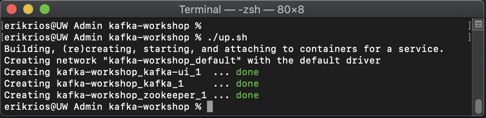
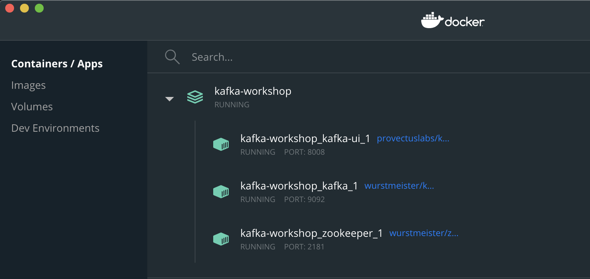
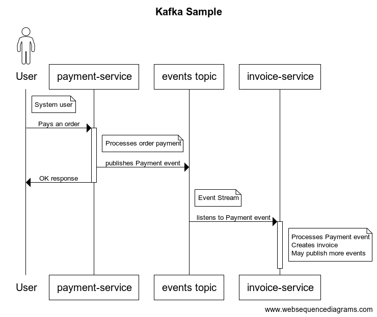

# Local Kafka with Docker

This guide will help yoy to install Kafka locally and be able to use it.

For this guide, we are going to use these 3 Docker images:

* Zookeeper
  * Main page: https://zookeeper.apache.org
  * Docker image Github repo: https://github.com/wurstmeister/zookeeper-docker
  * Docker image location: https://hub.docker.com/r/wurstmeister/zookeeper

* Kafka
  * Main page: https://kafka.apache.org
  * Github repo: https://github.com/wurstmeister/kafka-docker
  * Docker image: https://hub.docker.com/r/wurstmeister/kafka/

* Kafka-ui
  * Main Page & Github repo: https://github.com/provectus/kafka-ui
  * Docker image: https://hub.docker.com/r/provectuslabs/kafka-ui

We have a `docker-compose.yml` file ready with all the configurations needed, to mount and run the applications, so we simply run:

* `./up.sh` (macOS, Unix) or `up.bat` (Windows)



You can verify that everything went smooth by going to Docker desktop and look for the name of the folder where the docker-compose file is located. In this sample, `kafka-workshop`, and it should show up with green icons, just like this: 



Now you can go to http://localhost:8008/ui and get familiar with `Kafka UI`, a tool that helps you to visualize your Kafka data in a comprehensible way.

# Sample Producer and Consumer

In the `/backend` folder, there are 3 java maven projects:

* kafka-models
* payment-service
* invoice-service



Open `kafka-models` and run `mvn clean install`. This should create the shared, required jar that contains the `Payment` Kafka model. 
In this sample, we are serializing our data in JSON format so that it can be readable in Kafka UI. Common options in the industry for production are `Apache Avro` and `Google Protobuf`. 

Now we can run both of our services. In `payment-service`, there is a POST we can use at `localhost:9000/payment/payOrder` with a payload like this:

```json
{
    "orderId": 1
}
```

Each time we hit it, `payment-service`, will process our request, and will publish a `Payment` event, that `invoice-service` will read and log just so you can see how the communication happens. Even if there are events while `invoice-service` is offline, it will read the missing events from Kafka once it starts.

If you take a look in Kafka UI, you will see the `payments` topic in this URL: http://localhost:8008/ui/clusters/local/topics, and see the messages.

If you want to see the generated invoices based on your payments, just take a look at http://localhost:9001/invoices/search/findByOrderId?orderId=1


# More resources

Designing Event-Driver Systems | Confluent https://www.confluent.io/designing-event-driven-systems/